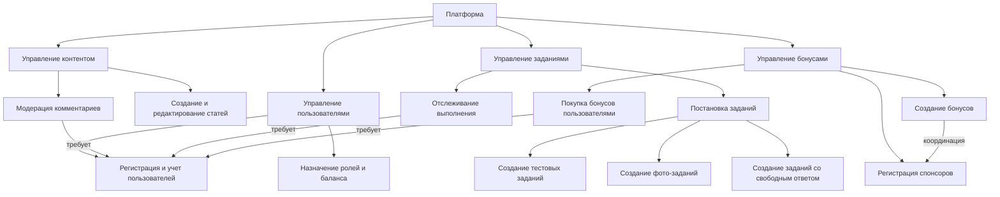

# Модели базы данных

## Функциональная модель

Ниже показана функциональная декомпозиция основных процессов, которые поддерживаются текущей структурой базы данных. Диаграмма отражает взаимосвязь между управлением пользователями, контентом, заданиями и бонусами, а также внешними участниками (спонсорами).



## Реляционная модель

Диаграмма отображает сущности, их основные атрибуты и связи (кардинальности) между таблицами, определенными в `init.sql`.

```mermaid
erDiagram
    USERS {
        int id PK
        text username
        text email
        text password_hash
        text role
        timestamptz created_at
        int balance
    }
    ARTICLES {
        int id PK
        text title
        text slug UK
        int author_id FK
        text body
        int rating
        timestamptz created_at
        timestamptz updated_at
    }
    COMMENTS {
        int id PK
        int article_id FK
        int user_id FK
        text body
        timestamptz created_at
    }
    TASKS {
        int id PK
        text title
        text description
        int cost
        timestamptz created_at
        text task_type
        timestamp updated_at
    }
    TEST_TASKS {
        int id PK/FK
        text[] options
        int correct_option
    }
    PHOTO_TASKS {
        int id PK/FK
        text expected_location
        text example_photo_url
    }
    FULL_ANSWER_TASKS {
        int id PK/FK
        text expected_answer
    }
    USER_TASKS {
        int id PK
        int user_id FK
        int task_id FK
        timestamptz completed_at
    }
    SPONSORS {
        int id PK
        text name
        text description
        timestamptz created_at
    }
    BONUSES {
        int id PK
        int sponsor_id FK
        text title
        text description
        int price
        timestamptz created_at
    }
    USER_BONUSES {
        int id PK
        int user_id FK
        int bonus_id FK
        timestamptz purchased_at
    }

    USERS ||--o{ ARTICLES : "author"
    ARTICLES ||--o{ COMMENTS : "receives"
    USERS ||--o{ COMMENTS : "writes"
    USERS ||--o{ USER_TASKS : "выполняет"
    TASKS ||--o{ USER_TASKS : "закреплены"
    TASKS ||--o{ TEST_TASKS : "specializes"
    TASKS ||--o{ PHOTO_TASKS : "specializes"
    TASKS ||--o{ FULL_ANSWER_TASKS : "specializes"
    SPONSORS ||--o{ BONUSES : "предлагает"
    BONUSES ||--o{ USER_BONUSES : "покупаются"
    USERS ||--o{ USER_BONUSES : "покупают"
```

## Пояснения

- **Наследование заданий.** Таблицы `test_tasks`, `photo_tasks` и `full_answer_tasks` наследуют базовые поля из `tasks`, что отражено как связь специализации в диаграмме. 【F:tomsk-db/init/init.sql†L187-L224】【F:tomsk-db/init/init.sql†L288-L295】
- **Связи пользователей с контентом.** Статьи и комментарии ссылаются на пользователей, а также каскадно удаляются или обнуляют автора при удалении пользователя. 【F:tomsk-db/init/init.sql†L71-L118】【F:tomsk-db/init/init.sql†L783-L808】
- **Программа лояльности.** Бонусы привязаны к спонсорам, а покупка бонусов пользователями фиксируется в `user_bonuses` с каскадным удалением. 【F:tomsk-db/init/init.sql†L111-L118】【F:tomsk-db/init/init.sql†L230-L235】【F:tomsk-db/init/init.sql†L792-L824】
- **Учет прогресса заданий.** Таблица `user_tasks` связывает пользователей и задания, обеспечивая уникальность пары пользователь/задание и каскадное удаление при удалении связанных записей. 【F:tomsk-db/init/init.sql†L337-L345】【F:tomsk-db/init/init.sql†L760-L840】
